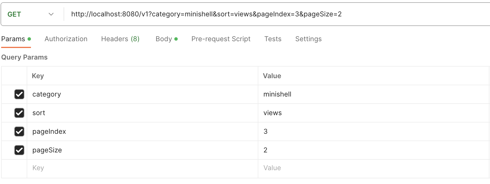

# 게시판 메인화면 불러오기

## 공통 정보

URL(endpoint): /v1?category=&sort=&pageIndex=&pageSize=

method: GET

기능명세 코드: A-MAI-00

## 요청시 데이터

Path Parameter : <input type="checkbox" value="Path Parameter" checked>

Request Body : <input type="checkbox" value="Request Body">

### Request Parameter

| Key | Data-Type | Description | Condition |
| --- | --- | --- | --- |
| category | string | 글의 카테고리 | ft_irc, minishell, minirt 셋 중 하나로 할 것 |
| sort | string | 정렬 기준 | lastest, views, recommends 셋 중 하나 |
| pagingIndex | int | 페이지의 사이즈 |
| pagingSize | int | 페이지의 인덱스 | 

### Request Body 

### 예시

- Path Parameter 내역



```json
// 아래는 요청할 때의 Path Parameter 데이터 예시입니다.
{
    "category" : "minishell"
    "sort" : "views"
    "pagingIndex" : 0
    "pagingSize" : 10 
}
```

***

## 응답시 데이터

[Response Body](https://www.notion.so/7877fd1d3fc749b8a10bed049ff0aa82?pvs=21)

### 성공

```json
// 아래는 성공시 응답 데이터 예시입니다.
// 아래의 요청시 Path parameter는 위의 요청시 데이터 예시를 참고해주세요.
// 요청시 Path parameter에 따라 응답 데이터가 달라집니다.

STATUS CODE: 200 OK

{
    "content": [
        {
            "questionId": 1,
            "title": "미니쉘 우웩",
            "answerCount": 1,
            "category": "minishell",
            "recommend": 0,
            "view": 0,
            "nickname": "san",
            "createdAt": "2023-07-04T16:45:48.683522",
            "content": "응 안해"
        }
    ],
    "pageable": {
        "sort": {
            "empty": true,
            "sorted": false,
            "unsorted": true
        },
        "offset": 0,
        "pageNumber": 0,
        "pageSize": 10,
        "paged": true,
        "unpaged": false
    },
    "last": true,
    "totalElements": 1,
    "totalPages": 1,
    "size": 10,
    "number": 0,
    "sort": {
        "empty": true,
        "sorted": false,
        "unsorted": true
    },
    "first": true,
    "numberOfElements": 1,
    "empty": false
}
```

### 실패