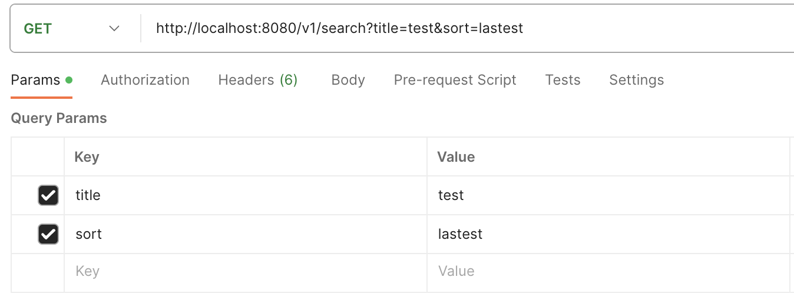

# 게시판 게시글 검색

## 공통 정보


<!-- 요청 시 URL 입니다. Root url에 대해서는 제외하고 서술합니다. -->
URL(endpoint): /v1/search?title={title}&sort={sort}

<!-- 요청 시 method 입니다. HTTP method를 기준으로 합니다. -->
method: GET

<!-- 요청 시 기능명세 코드 입니다. API가 활용되는 페이지를 기준으로 합니다. -->
기능명세 코드: A-MAI-01

## 요청시 데이터

<!-- 요청시에 Path Parameter, Request Parameter, 혹은 Query Parameter가 필요한 지에 대해 체크합니다. -->
<!-- 만약 해당되는 데이터가 없다면 표를 비워주세요. 제목을 포함한 항목을 지우시면 됩니다.-->
Path Parameter : <input type="checkbox" value="Path Parameter" checked>

Request Body : <input type="checkbox" value="Request Body">

Query Parameter : <input type="checkbox" value="Query Parameter">

### Path Parameter

<!-- 요청 시 데이터에 대해 명시하는 테이블입니다. -->
<!-- Key, Data-Type, Description, Condition 순으로 작성해주세요. -->
<!-- Key는 요청 시 데이터의 Key를,
    Data-Type은 요청 시 데이터의 Data-Type을,
    Description은 요청 시 데이터의 설명을,
    Condition은 요청 시 데이터의 조건을 명시해주세요. -->
| Key | Data-Type | Description | Condition |
| --- | --- | --- | --- |
| title | string | 검색할 제목, Content의 title에 해당하는 데이터 | |
| sort | string | 정렬 기준 | lastest, views, recommends 셋 중 하나 |


### 예시

- Path Parameter 내역



```json
// 아래는 요청할 때의 Path Parameter 데이터 예시입니다.
{
    "title" : "미니쉘",
    "sort" : "views"
}

// 아래는 요청할 때의 Request Body 데이터 예시입니다.
{
    // 없음
}

// 아래는 요청할 때의 Query Parameter 데이터 예시입니다.
{
    // 없음
}
```

***

## 응답시 데이터

### 성공

#### 데이터가 존재할 경우

```json
// 아래의 응답에 대한 요청은 위의 요청시 데이터 예시를 참고해주세요.
// 요청시 Path parameter에 따라 응답 데이터가 달라집니다.

// 응답시 HTTP Status Code는 아래와 같습니다.
STATUS CODE: 200 OK

// 아래는 응답시 전달될 데이터 예시입니다.
{
    "content": [
        {
            "questionId": 1,
            "title": "미니쉘 우웩",
            "answerCount": 0,
            "category": "MINISHELL",
            "recommend": 0,
            "view": 0,
            "nickname": "san",
            "createdAt": "2023-07-02T16:46:27.65347"
        }
    ],
    "pageable": {
        "sort": {
            "unsorted": true,
            "sorted": false,
            "empty": true
        },
        "pageSize": 10,
        "pageNumber": 0,
        "offset": 0,
        "paged": true,
        "unpaged": false
    },
    "totalPages": 1,
    "totalElements": 1,
    "last": true,
    "numberOfElements": 1,
    "size": 10,
    "number": 0,
    "first": true,
    "sort": {
        "unsorted": true,
        "sorted": false,
        "empty": true
    },
    "empty": false
}
```

#### 데이터가 존재하지 않을 경우

```json
// 아래의 응답에 대한 요청은 위의 요청시 데이터 예시를 참고해주세요.
// 요청시 Path Parameter와 Request Body에 따라 응답 데이터가 달라집니다.

// 응답시 HTTP Status Code는 아래와 같습니다.
STATUS CODE: 200 OK

// 아래는 응답시 전달될 데이터 예시입니다.
{
    "content": [
    ],
    "pageable": {
        "sort": {
            "unsorted": true,
            "sorted": false,
            "empty": true
        },
        "pageSize": 10,
        "pageNumber": 0,
        "offset": 0,
        "paged": true,
        "unpaged": false
    },
    "totalPages": 0,
    "totalElements": 0,
    "last": true,
    "numberOfElements": 0,
    "size": 10,
    "number": 0,
    "first": true,
    "sort": {
        "unsorted": true,
        "sorted": false,
        "empty": true
    },
    "empty": true
}
```

### 실패

#### Sort에서 잘못된 값이 들어올 경우
<!-- 실패시에는 어떻게 해서 실패한 코드인지 반드시 실패 사유를 적어주세요. -->

```json

// 응답시 HTTP Status Code는 아래와 같습니다.
STATUS CODE: 400 Bad Request

// 아래는 응답시 전달될 데이터 예시입니다.
{
    "message" : "sort standard incorrected - sort standard must be one of [lastest, views, recommends]"
}
```
<!-- 실패 사유가 여러가지 존재하여서 2개 이상의 실패 응답을 정의할 때에는 복수의 ### [실패사유] 탭을 만들어 주세요.-->